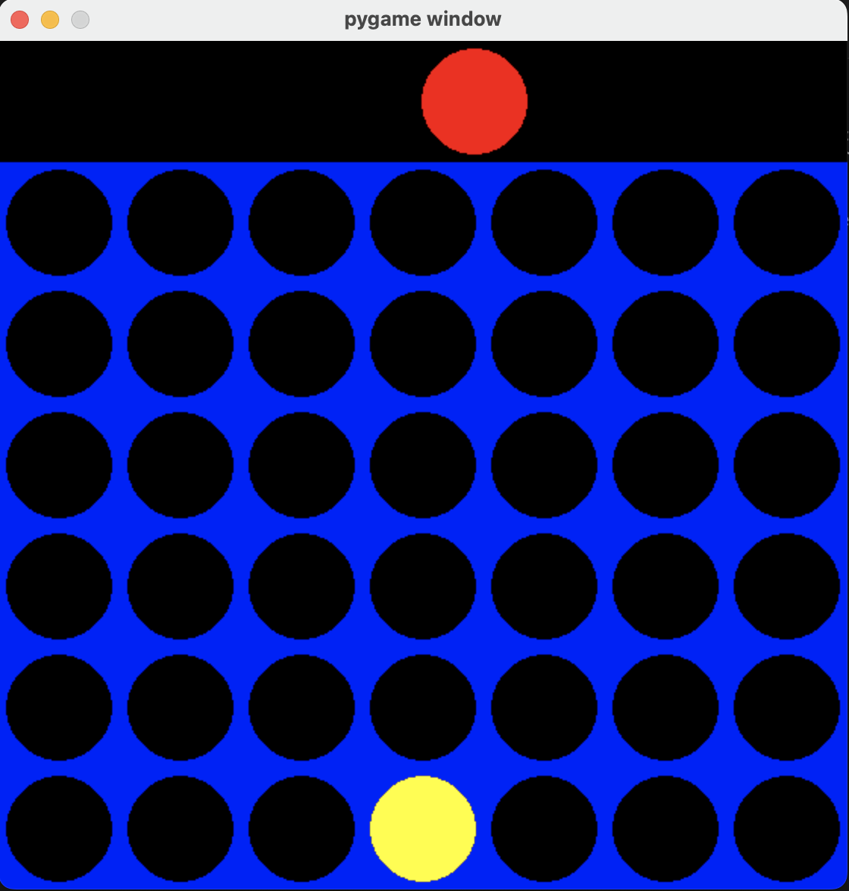

# Connect4-AI

A Connect Four game implementation in Python using Pygame, featuring an AI opponent powered by the Minimax algorithm with alpha-beta pruning.



## Features

- Two-player game mode (Player vs AI).
- AI opponent using the Minimax algorithm with alpha-beta pruning for optimized decision-making.
- Visual interface built with Pygame.
- Real-time game updates and player interactions.

## How to Play

1. Clone the repository.
2. Ensure you have Python and Pygame installed.
3. Run the game using the following command:
   ```bash
   python connect4.py
   ```
4. Enjoy the game! Player 1 is represented by the red pieces and the AI by the yellow pieces.

## Requirements

- Python 3.x
- Pygame

## Installation

1. Clone the repository:
   ```bash
   git clone https://github.com/yourusername/Connect4-AI.git
   ```
2. Navigate to the project directory:
   ```bash
   cd Connect4-AI
   ```
3. Install the required packages:
   ```bash
   pip install -r requirements.txt
   ```

## Contributing

Contributions are welcome! Please fork this repository, make your changes, and submit a pull request.

## License

This project is licensed under the MIT License.

## Contact

- **Email:** rattu786.ar@gmail.com
- **LinkedIn:** [Abdul Rehman Rattu](https://www.linkedin.com/in/abdul-rehman-rattu-395bba237)
