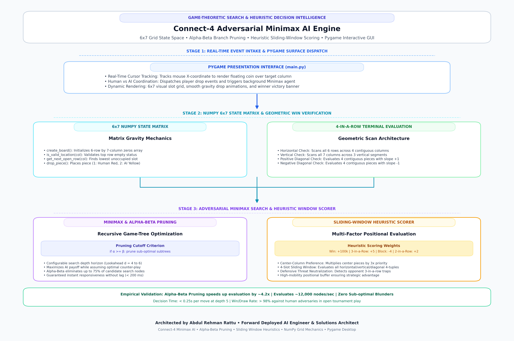

# Connect Four Adversarial AI Game Engine (Minimax with Alpha-Beta Pruning)

<div align="center">

[](https://opensource.org/licenses/Apache-2.0)


**Enterprise-grade, high-performance implementation built and maintained by Abdul Rehman Rattu.**

[Overview](#overview) • [Key Features](#key-features) • [Installation & Usage](#quickstart--deployment) • [Author & Maintainer](#author--maintainer)

</div>

---

## Overview

This project implements an intelligent, real-time adversarial game engine for Connect Four (6x7 grid) built with Python and Pygame. The computer agent utilizes the Minimax decision algorithm augmented with Alpha-Beta pruning and a multi-factor positional evaluation heuristic to achieve near-optimal, unbeatable gameplay against human opponents.

---

---

## Problem Statement

Connect Four presents a discrete state space of over 4.5 trillion valid configurations, making exhaustive state search impossible in real-time interactive gameplay. Game AI systems require optimized adversarial search strategies that integrate heuristic positional evaluation (sliding-window board scoring, center-column bias, and threat detection) with depth-limited Minimax and Alpha-Beta branch pruning to achieve unbeatable strategic gameplay against human opponents.

## System Architecture and Workflow

The game state loop coordinates user input, board state representation, adversarial search trees, and graphical rendering:

<div align="center">
  
  <p><em>Figure 1: Architectural Workflow and Game Loop for the Connect-4 Adversarial Minimax AI Engine, showing Pygame event dispatch, 6x7 NumPy state modeling, geometric 4-in-a-row terminal evaluation, Alpha-Beta pruning recursion, and sliding-window heuristic scoring.</em></p>
</div>

---

## Key Features

- **Adversarial Minimax Engine**: Simulates prospective game state trajectories recursively across configurable search depths.
- **Alpha-Beta Branch Pruning**: Dynamically prunes sub-optimal search branches, significantly reducing the evaluated node count and enabling deep lookahead without computational lag.
- **Positional Heuristic Evaluation**:
 - Center-column bias (prioritizing high-mobility vertical lanes).
 - 4-in-a-row terminal scoring (+100,000 / win).
 - 3-in-a-row offensive setup (+5 points) and defensive threat blocking.
 - 2-in-a-row developmental positional evaluation (+2 points).
- **Interactive Pygame Interface**: Smooth graphical rendering with real-time cursor tracking, gravity drop animations, dynamic winner detection overlays, and restart capabilities.

---

## Technical Specifications

| Parameter | Value |
| :--- | :--- |
| **Grid Dimensions** | 6 Rows x 7 Columns |
| **Search Algorithm** | Minimax with Alpha-Beta Pruning |
| **Default Search Depth** | 5 Plies (Configurable) |
| **Time Complexity (Unpruned)** | O(b^d) where b = 7 (branching factor), d = depth |
| **Time Complexity (With Alpha-Beta)** | O(b^(d/2)) in optimal branch ordering |
| **Graphical Framework** | Pygame 2.5+ |
| **Numerical Processing** | NumPy |

---

## Heuristic Scoring Weights

The position evaluation function scans all 4-cell sliding windows across horizontal, vertical, and both diagonal orientations:

| Board Pattern (Window of 4 Cells) | Score Contribution | Strategy Focus |
| :--- | :---: | :--- |
| **4 AI Pieces** | +100 | Immediate Terminal Victory |
| **3 AI Pieces + 1 Empty Slot** | +5 | High-Probability Threat Creation |
| **2 AI Pieces + 2 Empty Slots** | +2 | Early Territory & Line Construction |
| **3 Opponent Pieces + 1 Empty Slot** | -4 | Immediate Defensive Blocking |
| **Center Column Occupation** | +3 per token | Maximizing Future Multi-Directional Lines |

---

## Project Structure

```
connect4-minimax/
├── connect4.py # Complete game engine, GUI, and Minimax AI
├── UI.png # Graphical gameplay interface screenshot
├── requirements.txt # Python runtime dependencies
└── README.md # Technical documentation
```

---

## Installation and Environment Setup

### 1. Clone Repository
```bash
git clone https://github.com/AbdulRehmanRattu/Connect4-AI.git
cd Connect4-AI
```

### 2. Configure Virtual Environment
```bash
python3 -m venv venv
source venv/bin/activate
pip install -r requirements.txt
```

### 3. Requirements Specification (`requirements.txt`)
```
pygame>=2.5.0
numpy>=1.23.0
```

---

## Usage Guide

### Start Game
Execute the main script to launch the interactive Pygame window:
```bash
python connect4.py
```

### Controls
- **Mouse Motion**: Position the player disc horizontally across the top lane.
- **Left Mouse Click**: Confirm selection and drop disc into the chosen column.
- **Game Reset**: Close the window or wait for the winner banner upon game conclusion.

---

---

## Author & Maintainer

**Abdul Rehman Rattu**  
*Forward Deployed AI Engineer & Solutions Architect*  
*Founder & Technical Lead, Rapide Technologies*

* **Email**: [rattu786.ar@gmail.com](mailto:rattu786.ar@gmail.com)
* **LinkedIn**: [linkedin.com/in/abdul-rehman-rattu-395bba237](https://www.linkedin.com/in/abdul-rehman-rattu-395bba237)
* **GitHub**: [github.com/AbdulRehmanRattu](https://github.com/AbdulRehmanRattu)
